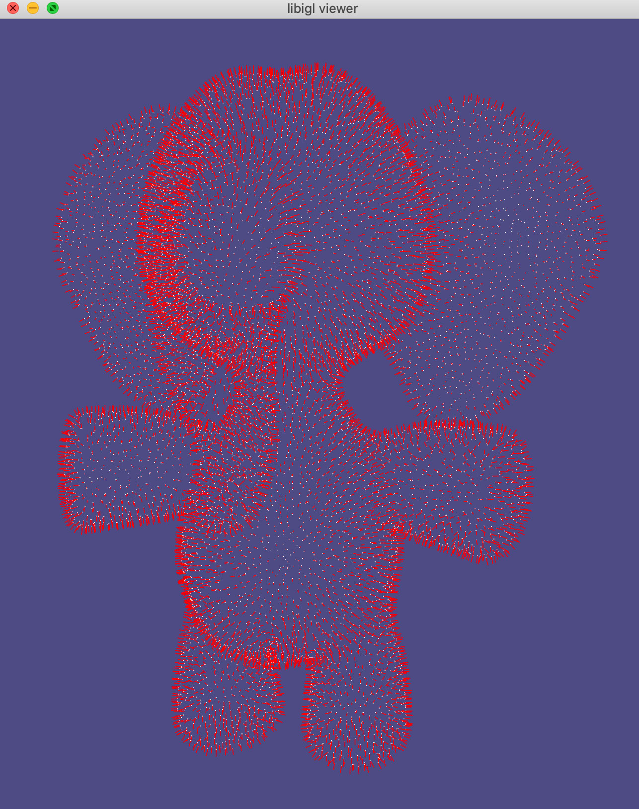
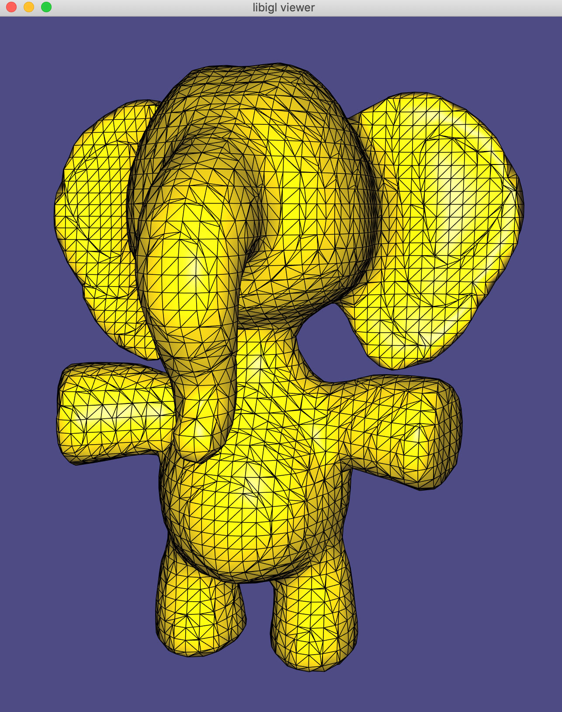
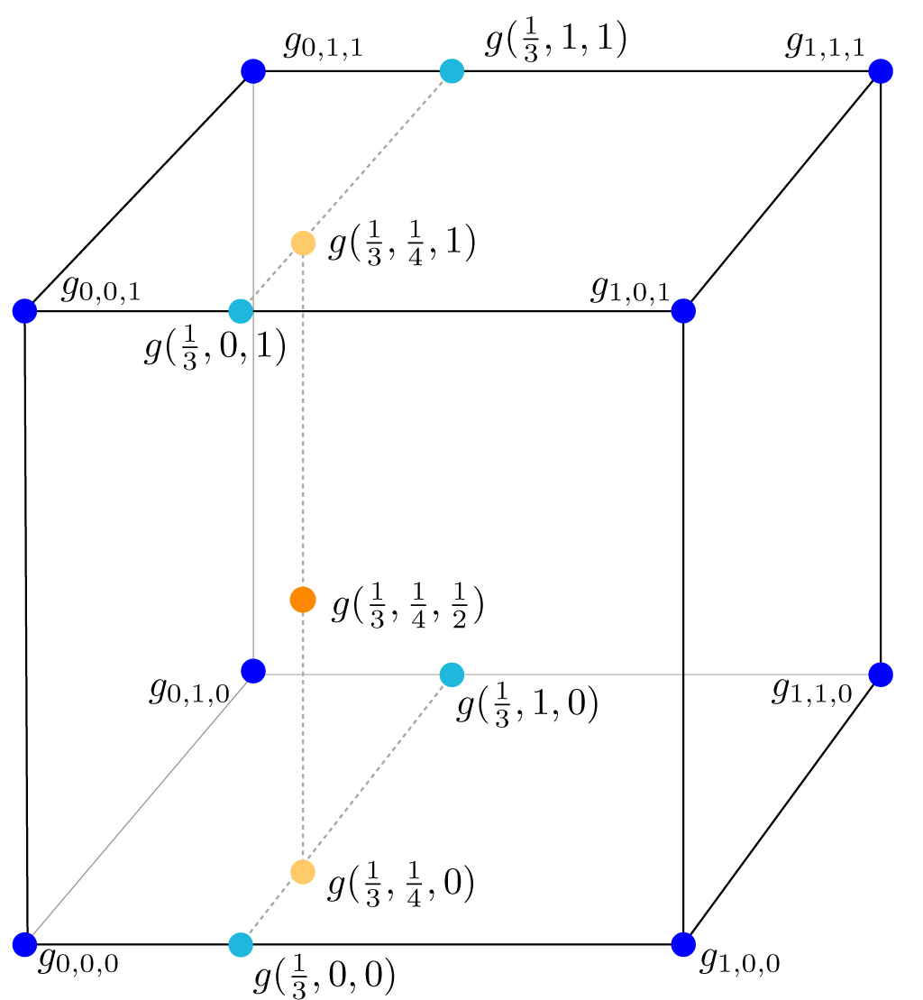
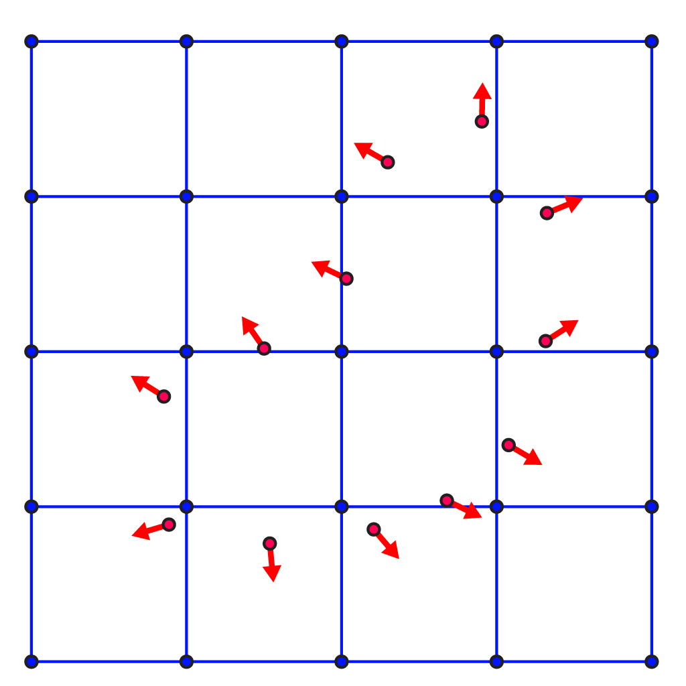
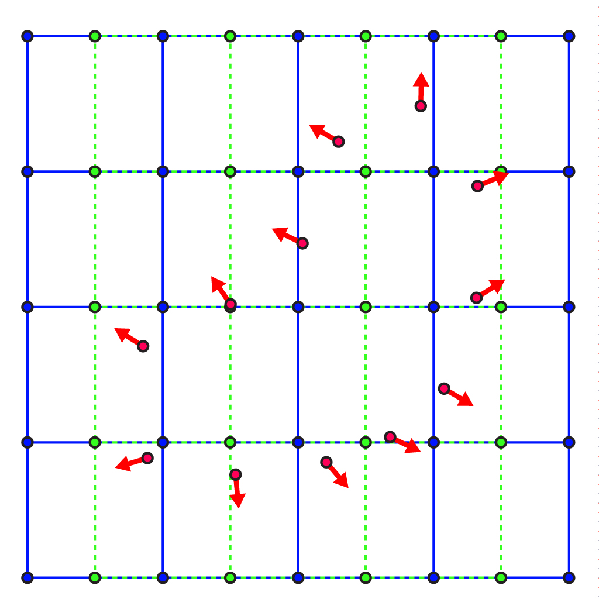
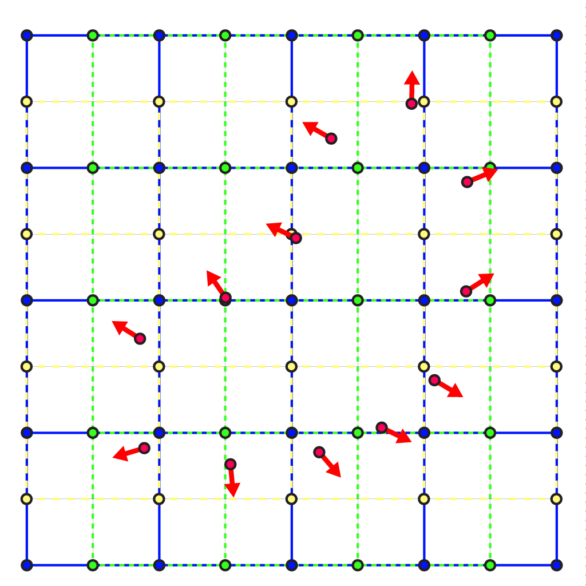

# Geometry Processing – Mesh Reconstruction

> **To get started:** Clone this repository then issue
> 
>     git clone --recursive http://github.com/alecjacobson/geometry-processing-mesh-reconstruction.git
>

## Installation, Layout, and Compilation

See
[introduction](http://github.com/alecjacobson/geometry-processing-introduction).

## Execution

Once built, you can execute the assignment from inside the `build/` using 

    ./mesh-reconstruction [path to point cloud]

## Background

In this assignment, we will be implementing a simplified version of the method
in  ["Poisson Surface Reconstruction" by Kazhdan et al. 2006.](papers/poisson-surface-reconstruction.pdf) (Your first "task"
will be to read and understand this paper).

Many scanning technologies output a set of $n$ point samples $\mathbf{P}$ on the 
surface of the object in question. From these points and perhaps the location
of the camera, one can also estimate normals $\mathbf{N}$ to the surface for each point
$\mathbf{p} \in  \mathbf{P}$. This image shows the `data/elephant.pwn` input
data with a white dot for each point and a red line segment pointing outward for
each corresponding normal vector.

For shape analysis, visualization and other downstream geometry processing
phases, we would like to convert this finitely sampled _point cloud_ data into
an _explicit continuous surface representation_: i.e., a [triangle
mesh](https://en.wikipedia.org/wiki/Triangulation%5F(topology)) (a special case
of a [polygon mesh](https://en.wikipedia.org/wiki/Polygon%5Fmesh)). This image
shows the corresponding output mesh for `data/elephant.pwn` input data above:

### Voxel-based Implicit Surface

Converting the point cloud directly to a triangle mesh makes it very difficult
to ensure that the mesh meets certain _topological_ postconditions: i.e., that
it is [manifold](https://en.wikipedia.org/wiki/Piecewise%5Flinear%5Fmanifold),
[closed](https://en.wikipedia.org/wiki/Manifold#Manifold%5Fwith%5Fboundary),
and has a small number of
[holes](https://en.wikipedia.org/wiki/Genus%5F(mathematics)).

Instead we will first convert the point cloud _sampling representation_ into a
an _[implicit surface
representation](https://en.wikipedia.org/wiki/Implicit%5Fsurface)_: where the
unknown surface is defined as the
[level-set](https://en.wikipedia.org/wiki/Level%5Fset) of some function $g: \mathbf{R}^3 \Rightarrow  \mathbf{R}$
mapping all points in space to a scalar value. For example, we may define
the surface $\partial \mathbf{S}$ of some solid, 
volumetric shape $\mathbf{S}$ to be all points $\mathbf{x} \in \mathbf{R}^3$ such that $g(x) = {\sigma}$, where we may arbitrarily set ${\sigma}=\frac12 $.

$$
\partial \mathbf{S} = \{\mathbf{x} \in  \mathbf{R}^3  | g(\mathbf{x})  = {\sigma}\}.
$$

On the computer, it is straightforward
[discretize](https://en.wikipedia.org/wiki/Discretization) an implicit
function. We define a regular 3D grid of
[voxels](http://en.wikipedia.org/wiki/Voxel) containing at least the [bounding
box](https://en.wikipedia.org/wiki/Minimum%5Fbounding%5Fbox) of $\mathbf{S}$. At each
node in the grid $\mathbf{x}\_{i,j,k}$ we store the value of 
the implicit function $g(\mathbf{x}\_{i,j,k})$. This defines $g$ _everywhere_ in the grid via [trilinear
interpolation](https://en.wikipedia.org/wiki/Trilinear_interpolation). 

For example, consider a point $\mathbf{x} = (\frac13 ,\frac14 ,\frac12)$ lying in the middle of the
bottom-most, front-most, left-most cell. We know the values at the eight
corners. Trilinear interpolation can be understood as [linear
interpolation](https://en.wikipedia.org/wiki/Linear_interpolation) in the
$x$-direction by $\frac13$ on each $x$-axis-aligned edge, resulting in four values
_living_ on the same plane. These can then be linearly interpolated in the $y$
direction by $\frac14$ resulting in two points on the same line, and finally in the
$z$ direction by $\frac12$ to get to our evaluation point $(\frac13 ,\frac14 ,\frac12 )$.

An implicit surface stored as the level-set of a trilinearly interpolated grid
can be _contoured_ into a triangle mesh via the [Marching Cubes
Algorithm](https://en.wikipedia.org/wiki/Marching&5Fcubes). 
For the purposes of this assignment, we will treat this as a [black
box](https://en.wikipedia.org/wiki/Black%5Fbox). Instead, we focus on
determining what values for $g$ to store on the grid.

## Characteristic functions of solids

We assume that our set of points $\mathbf{P}$ lie on the surface $\partial \mathbf{S}$ of some physical
[solid](https://en.wikipedia.org/wiki/Solid) object $\mathbf{S}$. This solid object
must have some non-trivial volume that we can calculate _abstractly_ as the
integral of unit density over the solid:

$$
\int \limits_\mathbf{S} 1 \;dA.                                                        %_
$$

We can rewrite this definite integral as an indefinite integral over all of
$\mathbf{R}^3$:

$$
\int \limits_{\mathbf{R}^3 } {\chi}_\mathbf{S}(\mathbf{x}) \;dA,
$$

by introducing the [characteristic
function](https://en.wikipedia.org/wiki/Indicator%5Ffunction) of $\mathbf{S}$, that is
_one_ for points inside of the shape and _zero_ for points outside of $\mathbf{S}$:

$$
{\chi}_\mathbf{S}(\mathbf{x}) = \begin{cases}
  1 & \text{ if $\mathbf{x} \in  \mathbf{S}$ } \\
  0 & \text{ otherwise}.
\end{cases}                                                             %_
$$

Compared to typical [implicit surface
functions](https://en.wikipedia.org/wiki/Implicit%5Fsurface), this function
represents the surface $\partial \mathbf{S}$ of the shape $\mathbf{S}$ as the _discontinuity_ between
the one values and the zero values. Awkwardly, the gradient of the
characteristic function ${\nabla}{\chi}_\mathbf{S}$ is _not defined_ along $\partial \mathbf{S}$.

One of the key observations made in [Kazhdan et al. 2006] is that the gradient
of a infinitesimally [mollified](https://en.wikipedia.org/wiki/Mollifier)
(smoothed) characteristic function: 

  1. points in the direction of the normal near the surface $\partial \mathbf{S}$, and 
  2. is zero everywhere else.

Our goal will be to use our points $\mathbf{P}$ and normals $\mathbf{N}$ to _optimize_ an
implicit function $g$ over a regular grid, so that its gradient ${\nabla}g$ meets
these two criteria. In that way, our $g$ will be an approximation of the
mollified characteristic function.

## Poisson surface reconstruction

### Or: how I learned to stop worrying and minimize squared Gradients

Let us start by making two assumptions:

  1. we know how to compute ${\nabla}g$ at each node location $\mathbf{x}_{i,j,k}$, and
  2. our input points $\mathbf{P}$ all lie perfectly at grid nodes: 
  $\exists\ \mathbf{x}\_{i,j,k}$ = $\mathbf{p}\_\ell$.

We will find out these assumptions are not realistic and we will have to relax
them (i.e., we **_will not_** make these assumptions in the completion of the
tasks). However, it will make the following algorithmic description easier on
the first pass.

If our points $\mathbf{P}$ lie at grid points, then our corresponding normals $\mathbf{N}$ also
_live_ at grid points. This leads to a very simple set of linear equations to
define a function $g$ with a gradient equal to the surface normal at the
surface and zero gradient away from the surface:

$$
{\nabla}g(\mathbf{x}\_{i,j,k}) = \mathbf{v}\_{i,j,k} := \begin{cases}
  \vphantom{\left(\begin{array}{c}
  0\\
  0\\
  0\end{array}\right)}
  \mathbf{n}\_\ell & \text{ if $\exists\ \mathbf{p}\_\ell = \mathbf{x}\_{i,j,k}$}, \\
  \left(\begin{array}{c}
    0\\
    0\\
    0\end{array}\right) & \text{ otherwise}.
\end{cases}
$$

This is a _vector-valued_ equation. The gradients, normals and zero-vectors are
three-dimensional (e.g., ${\nabla}g \in  \mathbf{R}^3 $). In effect, this is _three equations_ for
every grid node.

Since we only need a single number at each grid node (the value of $g$), we
have _too many_ equations.

Like many geometry processing algorithms confronted with such an [over
determined](https://en.wikipedia.org/wiki/Overdetermined%5Fsystem), we will
_optimize_ for the solution that best _minimizes_ the error of equation:

$$
\|  {\nabla}g(\mathbf{x}\_{i,j,k})  - \mathbf{v}\_{i,j,k}\| ^2 .
$$

We will treat the error of each grid location equally by minimizing the sum
over all grid locations:

$$
\mathop{\text{min}}\_\mathbf{g} \sum \_i \sum \_j \sum \_k \frac12  \|  {\nabla}g(\mathbf{x}\_{i,j,k})  - \mathbf{v}\_{i,j,k}\| ^2 ,
$$

where $\mathbf{g}$ (written in boldface) is a vector of _unknown_ grid-nodes values,
where $g_{i,j,k} = g(\mathbf{x}_{i,j,k})$. 

Part of the convenience of working on a regular grid is that we can use the
[finite difference
method](https://en.wikipedia.org/wiki/Finite_difference_method) to approximate
the gradient ${\nabla}g$ on the grid.

After revisiting [our assumptions](#assumptions), we will be able to compute
approximations of 
the $x$-, $y$- and $z$-components of ${\nabla}g$ via a [sparse
matrix](https://en.wikipedia.org/wiki/Sparse%5Fmatrix) multiplication of
a "gradient matrix" $\mathbf{G}$ and our vector of unknown grid values $\mathbf{g}$. We will be
able to write the
minimization problem above in matrix form:

$$
\mathop{\text{min}}_\mathbf{g} \frac12  \|  \mathbf{G} \mathbf{g} - \mathbf{v} \| ^2 ,
$$

or equivalently after expanding the norm:

$$
\mathop{\text{min}}_\mathbf{g} \frac12  \mathbf{g}^{\mathsf T} \mathbf{G}^{\mathsf T} \mathbf{G} \mathbf{g} - \mathbf{g}^{\mathsf T} \mathbf{G}^{\mathsf T} \mathbf{v} + \text{constant},
$$

This is a quadratic "energy" function of the variables of $\mathbf{g}$, its minimum occurs when
an infinitesimal change in $\mathbf{g}$ produces no change in the energy:

$$
\frac{\partial }{\partial \mathbf{g}} \frac12  \mathbf{g}^{\mathsf T} \mathbf{G}^{\mathsf T} \mathbf{G} \mathbf{g} - \mathbf{g}^{\mathsf T} \mathbf{G}^{\mathsf T} \mathbf{v} = 0.
$$

Applying this derivative gives us a _sparse_ system of linear equations

$$
\mathbf{G}^{\mathsf T} \mathbf{G} \mathbf{g} = \mathbf{G}^{\mathsf T} \mathbf{v}.
$$

We will assume that we can solve this using a black box sparse solver.

Now, let's revisit [our assumptions](#assumptions).

### Gradients on a regular grid

The gradient of a function $g$ in 3D is nothing more than a vector containing
partial derivatives in each coordinate direction:

$$
{\nabla}g(\mathbf{x}) = \left(\begin{array}{c}
    \frac{\partial g(\mathbf{x})}{\partial x} \\
    \frac{\partial g(\mathbf{x})}{\partial y} \\
    \frac{\partial g(\mathbf{x})}{\partial z}
  \end{array}\right).
$$

We will approximate each partial derivative individually. Let's consider the
partial derivative in the $x$ direction, $\partial g(\mathbf{x})/\partial x$, and we will assume
without loss of generality that what we derive applies _symmetrically_ for $y$
and $z$.

The partial derivative in the $x$-direction is a one-dimensional derivative.
This couldn't be easier to do with finite differences. We approximate the
derivative of the function $g$ with respect to the $x$ direction is the
difference between the function evaluated at one grid node and at the grid node
_before_ it in the $x$-direction then divided by the spatial distance between
adjacent nodes $h$ (i.e., the grid step size):

$$
\frac{\partial g(\mathbf{x}\_{i-\frac12 ,j,k})}{\partial x} = \frac{g\_{i,j,k} - g\_{i-1,j,k}}{h},
$$

where we use the index $i-\frac12$ to indicate that this derivative in the
$x$-direction lives on a [staggered
grid](https://en.wikipedia.org/wiki/Staggered%5Fgrid) _in between_ the grid
nodes where the function values for $g$.

The following pictures show a 2D example, where $g$ lives on the nodes of a
$5\times 5$ blue grid:

The partial derivatives of $g$ with respect to the $x$-direction $\partial g(\mathbf{x})/\partial x$
live on a $4 \times 5$ green, staggered grid:

The partial derivatives of $g$ with respect to the $y$-direction $\partial g(\mathbf{x})/\partial y$
live on a $5\times 4$ yellow, staggered grid:

Letting $\mathbf{g} \in  \mathbf{R}^{n_xn_yn_z \times  1}$ be column vector of function values on the
_primary grid_ (blue in the example pictures), we can construct a sparse matrix
$\mathbf{D}^x \in  \mathbf{R}^{(n_x-1)n_yn_z \times  n_xn_yn_z}$ so that each row $\mathbf{D}^x\_{i-\frac12 ,j,k} \in \mathbf{R}^{1 \times  n\_xn\_yn\_z}$ computes the partial derivative at the corresponding
staggered grid location $\mathbf{x}_{i-\frac12 ,j,k}$. The ℓth entry in that row receives a
value only for neighboring primary grid nodes:

$$
\mathbf{D}^x_{i-\frac12 ,j,k}(\ell) = 
  \begin{cases}
  -1 & \text{ if $\ell = i-1$ }\\
   1 & \text{ if $\ell = i$ }\\
   0 & \text{ otherwise}
  \end{cases}.
$$

> #### Indexing 3D arrays
> 
> Now, obviously in our code we cannot _index_ the column vector $\mathbf{g}$ by a
> triplet of numbers $\{i,j,k\}$ or the rows of $\mathbf{D}^x$ by the triplet
> ${i-\frac12 ,j,k}$. We will assume that $\mathbf{g}\_{i,j,k}$ refers to
> `g(i+j*n_x+k*n_y*n_x)`. Similarly, for the staggered grid subscripts
> ${i-\frac12 ,j,k}$ we will assume that $\mathbf{D}^x\_{i-\frac12 ,j,k}(\ell)$ refers to the matrix
> entry `Dx(i+j*n_x+k*n_y*n_x,l)`, where the $i-\frac12$ has been _rounded down_.
>

We can similarly build matrices $\mathbf{D}^y$ and $\mathbf{D}^z$ and _stack_ these matrices
vertically to create a gradient matrix $\mathbf{G}$:

$$
\mathbf{G} = 
\left(\begin{array}{c}
  \mathbf{D}^x \\
  \mathbf{D}^y \\
  \mathbf{D}^z
\end{array}\right)
  \in  \mathbf{R}^{ \left((n_x-1)n_yn_z + n_x(n_y-1)n_z + n_xn_y(n_z-1)\right)\times n_xn_yn_z}
$$

This implies that our vector $\mathbf{v}$ of zeros and normals in our minimization
problem should not _live_ on the primary, but rather it, too, should be broken
into $x$-, $y$- and $z$-components that live of their resepctive staggered
grids:

$$
\mathbf{v} = 
\left(\begin{array}{c}
  \mathbf{v}^x \\
  \mathbf{v}^y \\
  \mathbf{v}^z 
\end{array}\right)
  \in  \mathbf{R}^{ \left((n_x-1)n_yn_z + n_x(n_y-1)n_z + n_xn_y(n_z-1)\right)\times 1}.
$$

This leads to addressing our second assumption.

### B-b-b-b-but the input normals might not be at grid node locations?

At this point, we would _actually_ liked to have had that our input normals
were given component-wise on the staggered grid. Then we could immediate stick
them into $\mathbf{v}$. But this doesn't make much sense as each normal $\mathbf{n}\_\ell$ _lives_
at its associated point $\mathbf{p}\_\ell$, regardless of any grids.

To remedy this, we will distribute each component of each input normal $\mathbf{n}_\ell$
to $\mathbf{v}$ at the corresponding staggered grid node location.

For example, consider the normal $\mathbf{n}$ at some point $\mathbf{x}_{1,\frac14 ,\frac12 }$. Conceptually,
we'll think of the $x$-component of the normal $n_x$ as floating in the
staggered grid corresponding to $\mathbf{D}^x$, in between the eight staggered grid
locations:

$$
\mathbf{x}\_{\frac12 ,0,0},  \\
\mathbf{x}\_{1\frac12 ,0,0},   \\
\mathbf{x}\_{\frac12 ,1,0},  \\
\mathbf{x}\_{1\frac12 ,1,0},   \\
\mathbf{x}\_{\frac12 ,0,1},  \\
\mathbf{x}\_{1\frac12 ,0,1},   \\
\mathbf{x}\_{\frac12 ,1,1}, \text{ and } \\
\mathbf{x}\_{1\frac12 ,1,1}
$$

Each of these staggered grid nodes has a corresponding $x$ value in the vector
$\mathbf{v}^x$.

We will distribute $n_x$ to these entries in $\mathbf{v}^x$ by _adding_ a partial amount
of $n_x$ to each. I.e., 

$$
v^x\_{\frac12 ,0,0}  = w_{ \frac12 ,0,0}\left(\mathbf{x}\_{1,\frac14 ,\frac12 }\right)\ n_x,  \\
v^x\_{1\frac12 ,0,0} = w_{1\frac12 ,0,0}\left(\mathbf{x}\_{1,\frac14 ,\frac12 }\right)\ n_x,  \\
\vdots \\
v^x\_{1\frac12 ,1,1} = w_{1\frac12 ,1,1}\left(\mathbf{x}\_{1,\frac14 ,\frac12 }\right)\ n_x.
$$

where $w_{iِ+\frac12 ,j,k}(\mathbf{p})$ is the trilinear interpolation _weight_ associate with
staggered grid node $\mathbf{x}_{iِ+\frac12 ,j,k}$ to interpolate a value at the point $\mathbf{p}$.
The trilinear interpolation weights so that:

$$
n_x =   \\
  w_{ \frac12 ,0,0}( \mathbf{x}\_{1,\frac14 ,\frac12 } ) \  v^x\_{ \frac12 ,0,0} +  \\
  w_{1\frac12 ,0,0}( \mathbf{x}\_{1,\frac14 ,\frac12 } ) \  v^x\_{1\frac12 ,0,0} +  \\
  \vdots \\
  w_{1\frac12 ,1,1}( \mathbf{x}\_{1,\frac14 ,\frac12 } )\ v^x\_{1\frac12 ,1,1}.
$$

Since we need to do these for the $x$-component of each input normal, we will
assemble a sparse matrix $\mathbf{W}^x \in  n \times  (n_x-1)n_yn_z$ that _interpolates_
$\mathbf{v}^x$ at each point $\mathbf{p}$:

$$
  ( \mathbf{W}^x \mathbf{v}^x ) \in  \mathbf{R}^{n\times 1}
$$

the transpose of $\mathbf{W}^x$ is not quite its
[_inverse_](https://en.wikipedia.org/wiki/Invertible_matrix), but instead can
be interpreted as _distributing_ values onto staggered grid locations where
$\mathbf{v}^x$ lives:

$$
  \mathbf{v}^x = (\mathbf{W}^x)^{\mathsf T} \mathbf{N}^x.
$$

Using this definition of $\mathbf{v}^x$ and analogously for $\mathbf{v}^y$ and $\mathbf{v}^z$ we can
construct the vector $\mathbf{v}$ in our energy minimization problem above.

> ### BTW, what's [Poisson](https://en.wikipedia.org/wiki/Siméon_Denis_Poisson) got to do with it?
> 
> The discrete energy minimization problem we've written looks like the squared
> norm of some gradients. An analogous energy in the smooth world is the
> [Dirichlet energy](https://en.wikipedia.org/wiki/Dirichlet's_energy):
>
> $$
   E(g) = \int _{\Omega} \| {\nabla}g\| ^2  dA
$$
>
>
> to _minimize_ this energy with respect to $g$ as an unknown _function_, we
> need to invoke [Calculus of
> Variations](https://en.wikipedia.org/wiki/Calculus_of_variations) and
> [Green's First
> Identity](https://en.wikipedia.org/wiki/Green's_identities#Green.27s_first_identity).
> In doing so we find that minimizers will satisfy:
>
> $$
  {\nabla}\cdot {\nabla} g = 0 \text{ on ${\Omega}$},
$$
>
> 
> known as [Laplaces'
> Equation](https://en.wikipedia.org/wiki/Laplace%27s_equation).
>
> If we instead start with a slightly different energy:
> 
> $$
  E(g) = \int _{\Omega} \| {\nabla}g - V\| ^2  dA,
$$
>
> 
> where $V$ is a vector-valued function. Then applying the same machinery we
> find that minimizers will satisfy:
>
> $$
  {\nabla}\cdot {\nabla} g = {\nabla}\cdot V \text{ on ${\Omega}$},
$$
>
> known as [Poisson's
> equation](https://en.wikipedia.org/wiki/Poisson%27s_equation). 
>
>
> Notice that if we interpret the transpose of our gradient matrix
> $\mathbf{G}^{\mathsf T}$ as a _divergence matrix_ (we can and we should), then the
> structure of these smooth energies and equations are directly preserved in
> our discrete energies and equations.
>
> This kind of _structure preservation_ is a major criterion for judging
> discrete methods.
>

### Choosing a good iso-value

Constant functions have no gradient. This means that we can add a constant
function to our implicit function $g$ without changing its gradient:

$$
{\nabla}g = {\nabla}(g+c) = {\nabla}g + {\nabla}c = {\nabla}g + 0.
$$

The same is true for our discrete gradient matrix $\mathbf{G}$: if the vector of grid
values $\mathbf{g}$ is constant then $\mathbf{G} \mathbf{g}$ will be a vector zeros.

This is potentially problematic for our least squares solve: there are many
solutions, since we can just add a constant. Fortunately, we _don't really
care_. It's elegant to say that our surface is defined at $g=0$, but we'd be
just as happy declaring that our surface is defined at $g=c$.

To this end we just need to find _a solution_ $\mathbf{g}$, and then to pick a good
iso-value ${\sigma}$.

As suggested in \[Kazhdan et al. 2006\], we can pick a good iso-value by
interpolating our solution $\mathbf{g}$ at each of the input points (since we know
they're on the surface) and averaging their values. For an appropriate
interpolation matrix $\mathbf{W}$ on the _primary (non-staggered) grid_ this can be
written as:

$$
{\sigma} = \frac{1}{n} \mathbf{1}^{\mathsf T} \mathbf{W} \mathbf{g},
$$

where $\mathbf{1} \in  \mathbf{R}^{n\times 1}$ is a vector of ones.

### Just how much does this assignment simplify \[Kazhdan et al. 2006\]?

Besides the insights above, a major contribution of \[Kazhdan et al. 2006\] was
to setup and solve this problem on an [adaptive
grid](https://en.wikipedia.org/wiki/Adaptive_mesh_refinement) rather than a
regular grid. They also track "confidence" of their input data effecting how
they smooth and interpolate values. As a result, their method is one of the
most highly used surface reconstruction techniques to this day.

> Consider adding your own insights to the wikipedia entry for [this
> method](https://en.wikipedia.org/wiki/Poisson's%5Fequation#Surface%5Freconstruction).

## Tasks

### Read \[Kazhdan et al. 2006\]

This reading task is not directly graded, but it's expected that you read and
understand this paper before moving on to the other tasks.

### `src/fd_interpolate.cpp`

Given a regular finite-difference grid described by the number of nodes on each
side (`nx`, `ny` and `nz`), the grid spacing (`h`), and the location of the
bottom-left-front-most corner node (`corner`), and a list of points (`P`),
construct a sparse matrix `W` of trilinear interpolation weights so that 
`P = W * x`. 

### `src/fd_partial_derivative.cpp`

Given a regular finite-difference grid described by the number of nodes on each
side (`nx`, `ny` and `nz`), the grid spacing (`h`), and a desired direction,
construct a sparse matrix `D` to compute first partial derivatives in the given
direction onto the _staggered grid_ in that direction.

### `src/fd_grad.cpp`

Given a regular finite-difference grid described by the number of nodes on each
side (`nx`, `ny` and `nz`), and the grid spacing (`h`), construct a sparse
matrix `G` to compute gradients with each component on its respective staggered
grid.

> #### Hint 
> Use `fd_partial_derivative` to compute `Dx`, `Dy`, and `Dz` and
> then simply concatenate these together to make `G`.

### `src/poisson_surface_reconstruction.cpp`

Given a list of points `P` and the list of corresponding normals `N`, construct
a implicit function `g` over a regular grid (_built for you_) using approach
described above.

You will need to _distribute_ the given normals `N` onto the staggered grid
values in `v` via sparse trilinear interpolation matrices `Wx`, `Wy` and `Wz`
for each staggered grid. 

Then you will need to construct and solve the linear system $\mathbf{G}^{\mathsf T} \mathbf{G} \mathbf{g} = \mathbf{G}^{\mathsf T} \mathbf{v}$.

Determine the iso-level `sigma` to extract from the `g`.

Feed this implicit function `g` to `igl::copyleft::marching_cubes` to contour
this function into a triangle mesh `V` and `F`.

Make use of `fd_interpolate` and `fd_grad`.

> #### Hint
> Eigen has many different [sparse matrix
> solvers](https://eigen.tuxfamily.org/dox-devel/group__TopicSparseSystems.html).
> For these _very regular_ matrices, it seems that the [conjugate gradient
> method](https://en.wikipedia.org/wiki/Conjugate_gradient_method) will
> outperform direct methods such as [Cholesky
> factorization](https://en.wikipedia.org/wiki/Cholesky_decomposition). Try
> `Eigen::BiCGSTAB`.

-------------------------------------------------------------------------------

> #### Hint 
> Debug in debug mode with assertions enabled. For Unix users on the
> command line use: 
> 
>     cmake -DCMAKE_BUILD_TYPE=Debug ../
> 
> but then try out your code in _release mode_ for much better performance
> 
>     cmake -DCMAKE_BUILD_TYPE=Release ../
